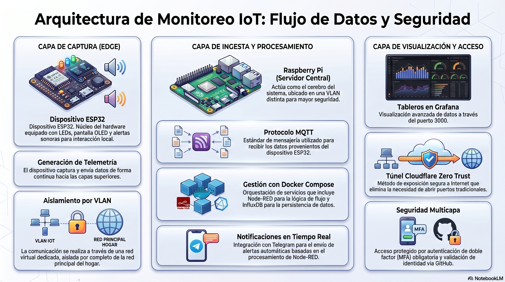
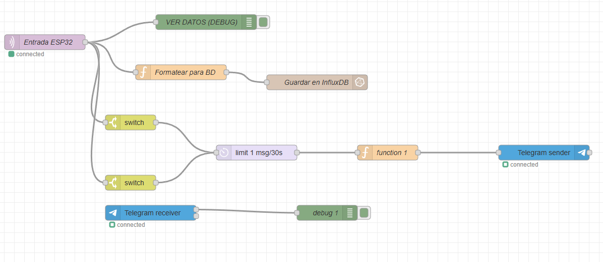
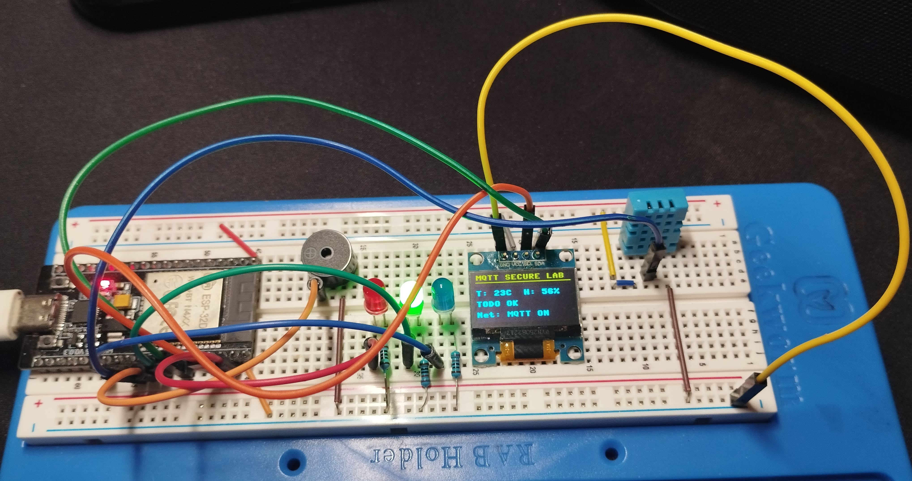
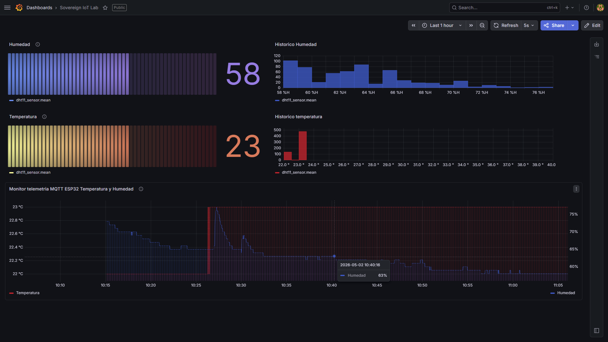
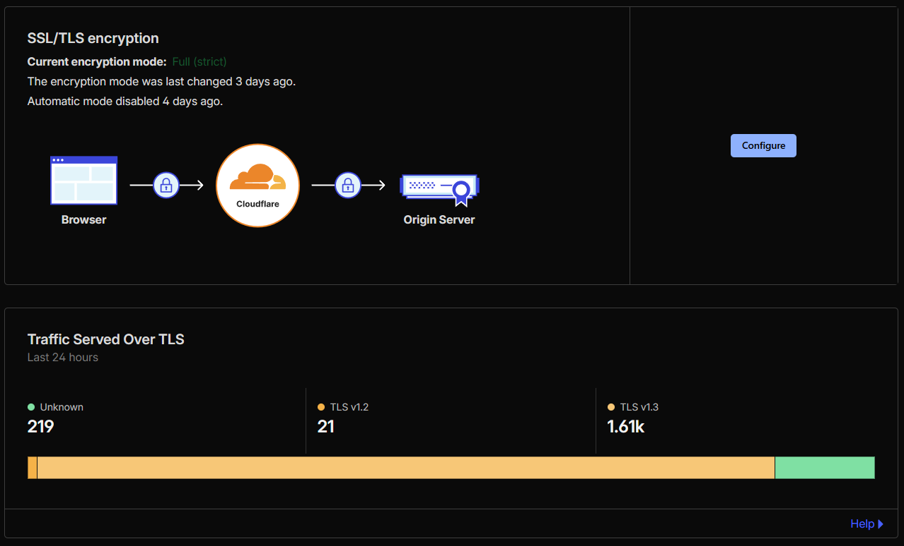

# Pipeline de Telemetría IoT  (Zero Trust Architecture)



Este repositorio proporciona la infraestructura completa para desplegar un sistema de telemetría IoT de grado empresarial. La arquitectura captura métricas ambientales (temperatura y humedad) a través de un nodo Edge (ESP32) y asegura el transporte de los datos utilizando el protocolo MQTT sobre TLS. Posteriormente, la información es orquestada en Node-RED, persistida en InfluxDB para el análisis de series temporales, y monitorizada en tiempo real mediante dashboards en Grafana, incorporando un sistema de notificaciones críticas vía Telegram.

El diseño destaca por su arquitectura **Security-First**. Para mitigar riesgos, el entorno implementa segmentación de red mediante VLANs (aislando los dispositivos IoT), cifrado de datos en tránsito, y políticas de autenticación estricta. Además, se garantiza un acceso remoto seguro sin exponer puertos públicos al exterior, utilizando **Cloudflare Zero Trust** como proxy inverso hacia la Raspberry Pi. Para respaldar esta infraestructura y asegurar la confianza de las conexiones de extremo a extremo, el sistema se apoya en un dominio personalizado que permite la validación oficial de certificados SSL/TLS.

---

## Arquitectura del Sistema

El flujo de los datos sigue este "pipeline":

1. **Edge (Hardware):** Un ESP32 lee el sensor DHT11 y publica la telemetría en formato JSON.
2. **Broker (Mosquitto):** Recibe los mensajes en el topic `sovereign/telemetria`.
3. **Procesamiento (Node-RED):** Actúa como el cerebro. Filtra datos, formatea para la base de datos y evalúa si hay que disparar alarmas.
4. **Almacenamiento (InfluxDB):** Base de datos de series temporales (Time-Series Database) para guardar el histórico.
5. **Visualización (Grafana):** Se conecta a InfluxDB para mostrar los datos en dashboards interactivos.
6. **Alertas (Telegram):** Node-RED envía notificaciones a un Bot si se superan los umbrales de seguridad.




---

## 💻 Hardware Utilizado

- Placa base: **ESP32**
- Sensor: **DHT11** (Temperatura y Humedad)
- Pantalla: **OLED SSD1306** (Conexión I2C)
- Actuadores: **Buzzer** (Alarma sonora) y **LEDs** (Indicadores de estado RGB)



---
## 📋 Requisitos Previos

Antes de proceder con el despliegue, asegúrate de contar con lo siguiente:

* **Infraestructura:** Una Raspberry Pi (o servidor Linux) con `docker` y `docker-compose` instalados.
* **Red:** Conexión a internet estable.
* **Seguridad:** Un dominio personalizado (obligatorio para la gestión de certificados SSL/TLS oficiales vía Cloudflare).
* **Cuenta de Telegram:** Un Bot de Telegram creado y su correspondiente Token de API (necesario para las alertas críticas).
* **Entorno de desarrollo:** Thonny IDE (o similar) para flashear el código en el ESP32.

---

## ⚙️ Configuración del ESP32

Para que el nodo IoT funcione correctamente, sigue estos pasos:

1. **Librerías:** Asegúrate de copiar tanto `main.py` como `ssd1306.py` (el driver de la pantalla) a la raíz del ESP32. Sin el driver, el sistema no podrá inicializar la interfaz visual.
2. **Credenciales:** Renombra el archivo `src/esp32_sensor/secrets.example.py` a `secrets.py`. **Edítalo** para incluir tu SSID, contraseña WiFi, y las credenciales de tu broker MQTT. 
   > **⚠️ NOTA:** Este archivo `secrets.py` contiene información sensible y está incluido en el `.gitignore`. **Nunca lo subas al repositorio público.**

### Esquema de Conexión Física
Para realizar la conexión física entre el sensor DHT11, la pantalla OLED y el ESP32, sigue el siguiente esquema:
#### 📋 Resumen de Conexiones (Pinout)

| Componente | Pin ESP32 | Función en el Script |
| :--- | :--- | :--- |
| **Sensor DHT11** | GPIO 5 | Lectura de datos |
| **OLED (SDA)** | GPIO 21 | Comunicación I2C |
| **OLED (SCL)** | GPIO 22 | Comunicación I2C |
| **LED Verde** | GPIO 19 | Indicador de estado OK |
| **LED Azul** | GPIO 4 | Alerta Humedad |
| **LED Rojo** | GPIO 23 | Alerta Temperatura |
| **Buzzer** | GPIO 18 | Salida PWM (Alarma) |

---

### 💡 Notas Técnicas para el Montaje

* **Gestión de GND:** Asegúrate de que todos los componentes (OLED, sensor y LEDs) compartan el mismo pin **GND** del ESP32 para evitar lecturas erráticas.
* **Resistencia Pull-up (DHT11):** Si el sensor no devuelve datos, añade una resistencia de entre **4.7kΩ y 10kΩ** entre el pin de datos (GPIO 5) y el pin de 3.3V.
* **Estabilidad del Buzzer:** Al ser un componente inductivo, si notas reinicios inesperados al sonar la alarma, coloca un **condensador electrolítico (ej. 100µF)** entre los terminales VCC y GND del buzzer para filtrar el ruido eléctrico.
* **Protección de LEDs:** No olvides colocar una **resistencia limitadora (220Ω - 330Ω)** en serie con cada LED para proteger los puertos GPIO de tu placa ESP32.
* **Alimentación OLED:** La mayoría de pantallas OLED SSD1306 funcionan a 3.3V, pero verifica la etiqueta de tu módulo. Conéctala al pin de **3.3V** del ESP32 para evitar daños.


> Conexión física detallada: El sensor DHT11 conectado a GPIO 5, la pantalla OLED mediante I2C (GPIO 21 SDA, GPIO 22 SCL), y los actuadores (LEDs/Buzzer) en sus respectivos pines de salida.

---
## 📦 Stack de Software (Docker)

Toda la infraestructura del servidor corre sobre una Raspberry Pi (o servidor Linux) utilizando `docker-compose`. Los servicios están aislados en una red virtual llamada `iot-net`.

- `eclipse-mosquitto:latest` (Puerto 1883)
- `nodered/node-red:latest` (Puerto 1880)
- `influxdb:1.8` (Puerto 8086)
- `grafana/grafana-oss:latest` (Puerto 3000)



> Aqui vemos un ejemplo de las últimas 24 horas como desde la web monitorizo la temperatura y la humedad con alertas desde cualquier punto del planeta.
> 

---

## 📂 Estructura del Repositorio

El proyecto está organizado de la siguiente manera para separar la infraestructura (Docker) del código físico (MicroPython):

```
pipeline-telemetria-mqtt/
├── README.md                 # Esta documentación
├── docker/                   # Infraestructura de Servidor
│   ├── docker-compose.yml    # Orquestador de contenedores
│   ├── grafana-data/         # Volúmenes persistentes
│   ├── influxdb-data/
│   ├── mosquitto/
│   │   ├── config/
│   │   │   └── mosquitto.conf
│   │   └── data/
│   └── node-red/
│       └── flows.json        # Copia de seguridad de los flujos
├── scripts/                  # Scripts de automatización y utilidades
└── src/                      # Código fuente
    └── esp32_sensor/         # Código MicroPython para el nodo IoT
        ├── main.py           # Lógica principal del sensor
        ├── secrets.example.py# Plantilla de credenciales WiFi/MQTT
        └── ssd1306.py        # Driver de la pantalla OLED
```

## 🔒 Capa de Seguridad Implementada

Este laboratorio cumple con altos estándares de seguridad para IoT:

1. **Segmentación de Red:** El dispositivo IoT (ESP32) no tiene visibilidad del resto de la red local del hogar gracias a su aislamiento en una VLAN específica.
2. **Cifrado (TLS):** Los payloads de telemetría no viajan en texto plano; el ESP32 utiliza certificados TLS oficiales para comunicarse con el broker MQTT.
3. **Autenticación MQTT:** Acceso anónimo deshabilitado. Solo los clientes con credenciales válidas pueden publicar o suscribirse a los topics.
4. **Cloudflare Tunnel:** La Raspberry Pi actúa como servidor sin exponer puertos a Internet. Un demonio local (`cloudflared`) establece una conexión saliente segura hacia el dominio adquirido.
5. Acceso protegido por autentificación de doble factor MFA mediante Github y google authenticator.



Encriptacion modo Full Estricta para respetar la maxima seguridad que nos ofrece el tunel.

---
## 📂 Exploración del Repositorio

Puedes acceder directamente a los componentes del proyecto a través de estos enlaces:

* **[📂 Infraestructura Docker](docker/)**: Configuración de servicios (Mosquitto, Node-RED).
* **[📂 Código fuente ESP32](src/esp32_sensor/)**: Lógica, drivers y gestión de hardware del nodo IoT.
* **[📂 Scripts de utilidades](scripts/)**: Herramientas de automatización para mantenimiento del servidor.
## 🗺️ Roadmap / Próximos Pasos

Aunque el núcleo del sistema es completamente funcional y seguro, el proyecto sigue en evolución. Algunas posibles mejoras futuras incluyen:

- [ ]  Integración de un servidor local de DNS (Pi-hole/AdGuard) en la misma VLAN.
- [ ]  Incorporación de un segundo nodo ESP32 con sensores de calidad del aire (MQ-135).
- [ ]  Script de automatización (Bash) para realizar backups automáticos de los volúmenes de InfluxDB y Node-RED.
- [ ]  Se va a implementar próximamente la plataforma **Ignition** (Inductive Automation) para transformar este pipeline en una solución SCADA industrial completa.
- [ ]  **Visualización Perspective:** Creación de una HMI web y móvil de alto rendimiento compatible con estándares industriales.
- [ ]  **Scripts en Python:** Procesamiento de datos complejo en el servidor mediante el motor de scripting de Ignition.
- [ ]  **Reporting Engine:** Generación automática de reportes de estado y eficiencia del sistema.

---

## 👨‍💻 Autor

José Álvarez Domínguez Técnico de *Sistemas, Redes y Telemetría IoT*

- [Mi perfil de LinkedIn](https://linkedin.com/in/TU_USUARIO)

---

## 📄 Licencia

Este proyecto está bajo la Licencia **MIT**. Puedes usar, modificar y distribuir este código libremente, tanto para fines personales como comerciales, siempre y cuando se incluya la nota de copyright original.
