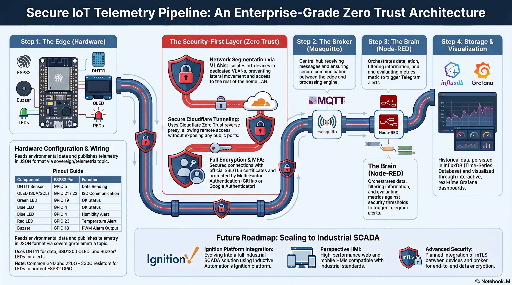

# IoT Telemetry Pipeline (Zero Trust Architecture)

This repository provides the complete infrastructure to deploy an enterprise-grade IoT telemetry system. The architecture captures environmental metrics (temperature and humidity) through an Edge node (ESP32). The information is then orchestrated in Node-RED, persisted in InfluxDB for time-series analysis, and monitored in real time through Grafana dashboards, incorporating a critical notification system via Telegram.

The design stands out for its **Security-First** architecture. To mitigate risks, the environment implements network segmentation through VLANs (isolating IoT devices), encryption of data in transit, and strict authentication policies. In addition, secure remote access is guaranteed without exposing public ports to the outside world, using **Cloudflare Zero Trust** as a reverse proxy to the Raspberry Pi. To support this infrastructure and ensure end-to-end trusted connections, the system relies on a custom domain that enables official SSL/TLS certificate validation.

---

## System Architecture

The data flow follows this "pipeline":

1. **Edge (Hardware):** An ESP32 reads the DHT11 sensor and publishes telemetry in JSON format.
2. **Broker (Mosquitto):** Receives messages on the `sovereign/telemetria` topic.
3. **Processing (Node-RED):** Acts as the brain. It filters data, formats it for the database, and evaluates whether alarms should be triggered.
4. **Storage (InfluxDB):** A time-series database (TSDB) to store the historical data.
5. **Visualization (Grafana):** Connects to InfluxDB to display data in interactive dashboards.
6. **Alerts (Telegram):** Node-RED sends notifications to a Bot if security thresholds are exceeded.

---

## 💻 Hardware Used

- Main board: **ESP32**
- Sensor: **DHT11** (Temperature and Humidity)
- Display: **OLED SSD1306** (I2C connection)
- Actuators: **Buzzer** (audible alarm) and **LEDs** (RGB status indicators)

---

## Prerequisites

Before proceeding with the deployment, make sure you have the following:

* **Infrastructure:** A Raspberry Pi (or Linux server) with `docker` and `docker-compose` installed.
* **Network:** Stable internet connection.
* **Security:** A custom domain (required for managing official SSL/TLS certificates via Cloudflare).
* **Telegram account:** A Telegram Bot created and its corresponding API Token (required for critical alerts).
* **Development environment:** Thonny IDE (or similar) to flash the code to the ESP32.

---

## ⚙️ ESP32 Configuration

For the IoT node to work correctly, follow these steps:

1. **Libraries:** Make sure to copy both `main.py` and `ssd1306.py` (the display driver) to the root of the ESP32. Without the driver, the system will not be able to initialize the visual interface.
2. **Credentials:** Rename the file `src/esp32_sensor/secrets.example.py` to `secrets.py`. **Edit it** to include your SSID, WiFi password, and your MQTT broker credentials.
   > **⚠️ NOTE:** This `secrets.py` file contains sensitive information and is included in `.gitignore`. **Never upload it to a public repository.**

### Physical Wiring Diagram

To connect the DHT11 sensor, the OLED screen, and the ESP32, follow this wiring scheme:

#### 📋 Connection Summary (Pinout)

| Component | ESP32 Pin | Function in the Script |
| :--- | :--- | :--- |
| **DHT11 Sensor** | GPIO 5 | Data reading |
| **OLED (SDA)** | GPIO 21 | I2C communication |
| **OLED (SCL)** | GPIO 22 | I2C communication |
| **Green LED** | GPIO 19 | OK status indicator |
| **Blue LED** | GPIO 4 | Humidity alert |
| **Red LED** | GPIO 23 | Temperature alert |
| **Buzzer** | GPIO 18 | PWM output (alarm) |

---

### 💡 Technical Notes for Assembly

* **GND management:** Make sure all components (OLED, sensor, and LEDs) share the same **GND** pin on the ESP32 to avoid erratic readings.
* **Pull-up resistor (DHT11):** If the sensor does not return data, add a **4.7kΩ to 10kΩ** resistor between the data pin (GPIO 5) and 3.3V.
* **Buzzer stability:** Since it is an inductive component, if you notice unexpected resets when the alarm sounds, place an **electrolytic capacitor (e.g., 100µF)** between the buzzer's VCC and GND terminals to filter electrical noise.
* **LED protection:** Don’t forget to place a **current-limiting resistor (220Ω - 330Ω)** in series with each LED to protect the ESP32 GPIO pins.
* **OLED power:** Most SSD1306 OLED displays run at 3.3V, but verify the label on your module. Connect it to the ESP32’s **3.3V** pin to avoid damage.

> Detailed physical connection: the DHT11 sensor connected to GPIO 5, the OLED display via I2C (GPIO 21 SDA, GPIO 22 SCL), and the actuators (LEDs/Buzzer) on their respective output pins.

---

## 📦 Software Stack (Docker)

All server infrastructure runs on a Raspberry Pi (or Linux server) using `docker-compose`. Services are isolated on a virtual network called `iot-net`.

- `eclipse-mosquitto:latest` (Port 1883)
- `nodered/node-red:latest` (Port 1880)
- `influxdb:1.8` (Port 8086)
- `grafana/grafana-oss:latest` (Port 3000)

> Here we see an example of the last few hours, showing how I monitor temperature and humidity from the web, along with historical averages and Telegram alerts according to the parameters I define, from anywhere on the planet.

---

## 🔒 Implemented Security Layer

This lab meets high security standards for IoT:

1. **Network segmentation:** The IoT device (ESP32) has no visibility into the rest of the home LAN thanks to its isolation in a dedicated VLAN.
2. **MQTT authentication:** Anonymous access disabled. Only clients with valid credentials can publish or subscribe to topics.
3. **Cloudflare Tunnel:** The Raspberry Pi acts as a server without exposing ports to the Internet. A local daemon (`cloudflared`) establishes a secure outbound connection to the purchased domain.
4. Access protected by multi-factor authentication (MFA) through GitHub and Google Authenticator.

Full (Strict) encryption mode to ensure the highest security that the tunnel provides.

---

## 📂 Repository Exploration

You can access the project components directly through these links:

* **[📂 Docker Infrastructure](docker/):** Services configuration (Mosquitto, Node-RED).
* **[📂 ESP32 Source Code](src/esp32_sensor/):** Logic, drivers, and hardware management for the IoT node.

## Infrastructure Details (Docker & Environment)

### Orchestration and Networks

The `docker-compose.yml` file doesn’t just bring up services—it implements a secure network topology:

*   **iot-frontend:** Bridge network for communication between the MQTT broker and the logic engine.
*   **iot-backend (Internal):** Isolated network without a default gateway (0.0.0.0/0). InfluxDB lives here to prevent data exfiltration or direct attacks from outside.

### Environment Management (.env)

A `.env` file is used to inject configuration at runtime.

**Why do we use USER_ID and GROUP_ID?**  
To avoid containers running as `root`. By mapping your Linux user's UID/GID, the files written in persistent volumes belong to you rather than the superuser, improving host hardening.

**Instructions:**
1. Copy the template: `cp .env.example .env`
2. Adjust paths and IDs according to your system (`id -u`).

## 🗺️ Roadmap / Next Steps

Although the core system is fully functional and secure, the project is still evolving. Possible future improvements include:

- [ ] Integration of mTLS between the device and the broker to encrypt data.
- [ ] Addition of a second ESP32 node with air-quality sensors (MQ-135).
- [ ] Automation script (Bash) to perform automatic backups of InfluxDB and Node-RED volumes.
- [ ] The **Ignition** platform (Inductive Automation) will be implemented soon to turn this pipeline into a complete industrial SCADA solution.
- [ ] **Perspective Visualization:** Creation of a high-performance web and mobile HMI compatible with industrial standards.
- [ ] **Python scripts:** Complex data processing on the server using Ignition’s scripting engine.
- [ ] **Reporting Engine:** Automatic generation of status and efficiency reports.

---

## 👨‍💻 Author

José Álvarez Domínguez, IoT Telemetry, Systems & Networks Technician

- [My LinkedIn profile](https://linkedin.com/in/TU_USUARIO)

---

## 📄 License

This project is licensed under the **MIT** License. You can use, modify, and distribute this code freely, for personal or commercial purposes, as long as the original copyright notice is included.
